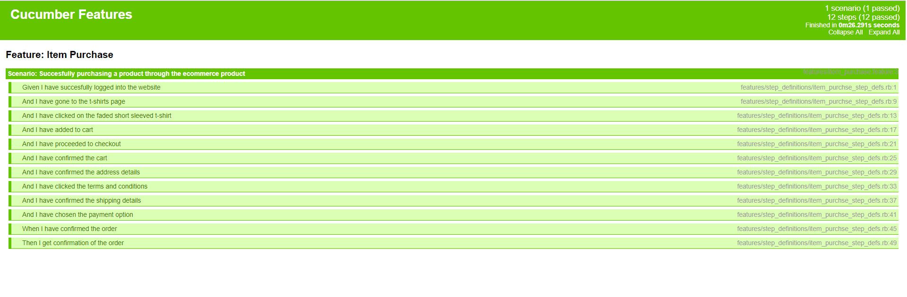

# Sparta_Global_SDET_Cucumber_POM_Project

This project was based on testing my POM created to buy a product from the E-commerce website (http://automationpractice.com/index.php). The POM created used capybara to conduct the methods and rspec to run the tests and methods. This lab put that POM into cucumber which is a software testing tool and used gherkin to create features. These features consisted of scenarios, in this case there was one scenario which was allowing a user to purchase a product from the website. The scenarios consisted of given, when and then, for what has been inputted then the trigger and then for the output. The program can be run by using the cucumber tool. Another benefit of cucumber is that it generated reports in a specified format to show the passing of tests in a clear format to users. In this case the results were generated to a html file and can be accessed by right clicking on the test_html.html file in the reports folder. Then clicking the option to copy the full path and this can simply be entered into your browser to view the output of the report. The link would be relevant to your local system.

